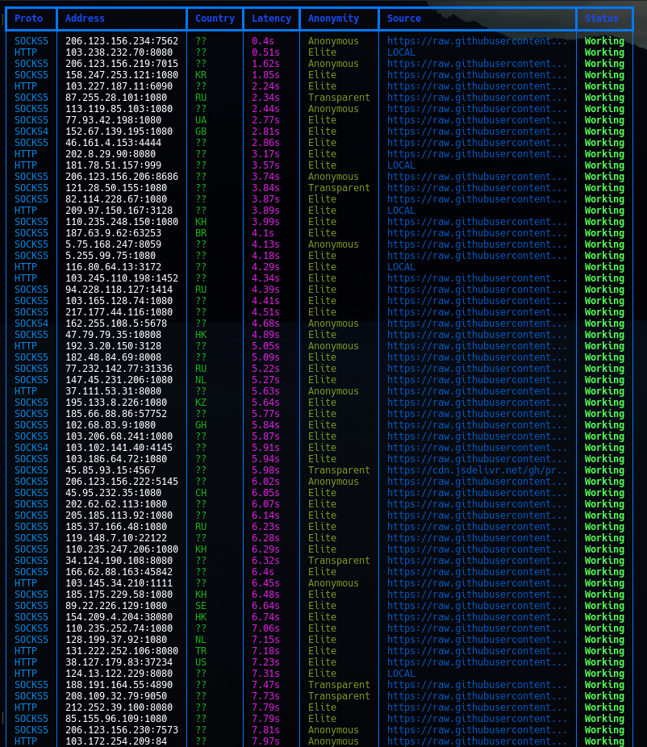
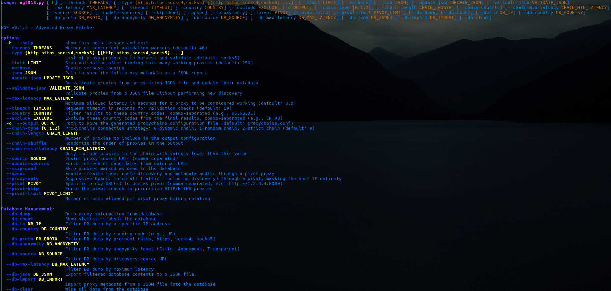
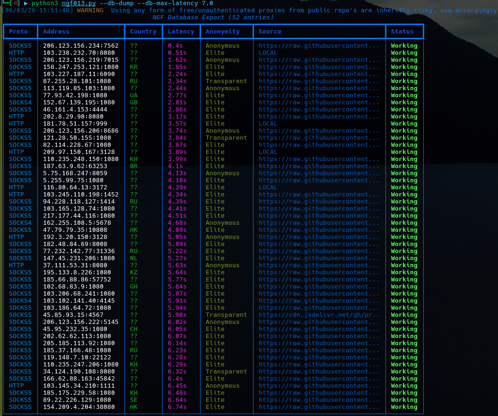
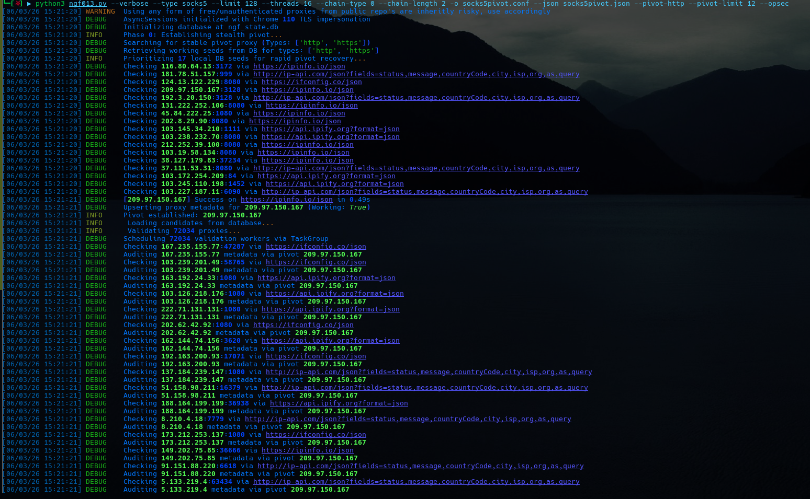

<h1 align="center">Next-Generation-Fetch</h1>

<p align="center">
  <strong>An enterprise-grade, OpSec-aware proxy harvesting, validation suite</strong><br>
  designed for security professionals and researchers.
</p>

<div align="center">
  
  
</div>
<p align="center">
  Unlike traditional fetchers, NGF focuses on <strong>stealth pivoting</strong>, <strong>TLS impersonation</strong>, 
  <strong>deep metadata enrichment</strong>, and <strong>persistent state</strong> to provide a high-quality, reliable 
  list of proxies suitable for tools like <code>proxychains</code>, <code>Clash</code>, and <code>sing-box</code>.
</p>

---

<p align="center">
Author: J4ck3LSyN | Version: 0.1.6 | License: MIT | Authority: Chaos Foundry Security Division
</p>

---

## Table of Contents

- [Key Technical Features](#key-technical-features)
- [Changelog (v0.1.6)](#changelog-v016)
- [Installing Proxychains (recommended)](#installing-proxychains-recommended)
- [Installing NGF](#installing-ngf)
- [All the Details](#all-the-details)
  - [Threads, Types, Limits and Verbosity](#threads-types-limits-and-verbosity)
  - [Output Formats](#output-formats)
  - [Proxychains Configuration](#proxychains-configuration)
  - [JSON Files](#json-files)
  - [Clash Meta Configuration](#clash-meta-configuration)
  - [Sing-Box Configuration](#sing-box-configuration)
  - [Sources](#sources)
  - [OpSec and Pivot](#opsec-and-pivot)
  - [Country Filtering](#country-filtering)
  - [Audit & DNS Leak Detection](#audit--dns-leak-detection)
  - [Remote JSON Loading](#remote-json-loading)
  - [Instructions File (Non-Interactive Mode)](#instructions-file-non-interactive-mode)
  - [Configuration File](#configuration-file)
- [Working with the Database](#working-with-the-database)
- [Proper Workflow](#proper-workflow)
- [Advanced Technical Notes (v0.1.6)](#advanced-technical-notes-v016)
- [Operational Security (OpSec) Logic](#operational-security-opsec-logic)
- [Architecture](#architecture)
- [Disclaimer](#disclaimer)

---

## Key Technical Features

*   **Persistent SQLite State (WAL Mode):** Uses a local database (`ngf_state.db`) with Write-Ahead Logging for high-concurrency performance. Includes specific PRAGMA optimizations (`busy_timeout=8000`, `mmap_size=2GB`, `cache_size=256MB`, `temp_store=MEMORY`) for stability on shared filesystems (WSL/NFS) and index-driven queries for rapid metadata filtering across every key field.
*   **Stealth Pivot Mechanism:** Implements a multi-stage "Phase 0" bootstrap that prioritizes manual pivots → high-reliability database seeds → fresh source bootstrap. Includes automatic health monitoring, usage-limit rotation, and IP blacklisting to ensure a secure gateway is established before any third-party API is contacted.
*   **Advanced TLS Impersonation:** Utilizes `curl_cffi` to impersonate a **Chrome 110** browser fingerprint. This bypasses modern anti-bot and CDN-level protections (Cloudflare, Akamai, etc.) that typically block standard Python `requests` or `httpx` headers.
*   **Asynchronous Pipeline:** Leverages `asyncio` with semaphores for granular concurrency control — separate pools for validation workers (`CONCURRENCY_LIMIT`), network gathering (`NETWORK_CONCURRENCY_LIMIT`), and in-flight verification requests (`verification_in_flight_sem=30`).
*   **Deep Metadata Validation:**
    *   **Anonymity Detection:** Elite, Anonymous, and Transparent classification based on IP comparison.
    *   **Remote DNS (SOCKS5h):** Automatically uses `socks5h://` for SOCKS5 proxies to ensure DNS resolution happens at the proxy level, preventing local DNS leaks.
    *   **DNS Leak Detection:** Uses `edns.ip-api.com` to detect if a proxy's DNS resolver geo-location mismatches the proxy country, signaling a potential identity leak.
    *   **Geo-IP Enrichment:** ISP, ASN, City, and Country code attribution via `ip-api.com`.
    *   **Pivot-Based Audit:** Geo/ASN metadata enrichment is routed through the pivot proxy to mask the host IP.
*   **Multiple Export Formats:** Proxychains, Clash Meta YAML, sing-box JSON, simple TXT, and detailed JSON metadata reports.
*   **Remote JSON Ingestion:** Load proxy lists from remote `.json`, `.gz`, or `.tar.gz` archives with flexible schema detection.
*   **Instructions File Support:** Non-interactive mode for scripted/automated execution via YAML or JSON instruction files.
*   **Graceful Shutdown:** Signal handlers (`SIGTERM`/`SIGINT`), `asyncio.Event`-driven termination, background task cleanup, and database flush-on-exit.

---

## Changelog (v0.1.6)

*   **Major Overhaul — Output Pipeline**
    - Added **Clash Meta** configuration export (`--clash-output`): Generates a ready-to-use `clash.yaml` with proxies, proxy-groups, and routing rules.
    - Added **sing-box** configuration export (`--sing-box-output`): Generates a complete sing-box JSON config with inbounds, outbounds, and routing.
    - Added **simple TXT list** export (`--txt-output`): One proxy per line (`proto://ip:port`).
    - Added **proxychains** as a first-class dedicated export (`--proxychains-output`) with clean alignment, optional Tor appending (`--append-tor`), and strict chain formatting.
    - Exported proxies now support **latency filtering** (`--chain-min-latency`, `--chain-max-latency`), **elite-only filtering** (`--filter-elite-only`), and **chain length limiting** (`--chain-length`).

*   **Pivot Manager Refactoring (New `PivotManager` Class)**
    - Dedicated `PivotManager` class with `asyncio.Lock`-based state management.
    - Blacklist with TTL expiry (`duration` in seconds) for unreliable pivot IPs.
    - Automatic rotation on usage limit and failed health checks.
    - `--pivot-after`: Force pivot usage after a configurable number of validations (useful for mixed direct/proxied workflows).
    - `--pivot-http-only`: Restrict pivot candidates to HTTP/HTTPS for compatibility.
    - Improved bootstrap: Falls back to fetching fresh sources when DB seeds are insufficient.

*   **Proxy Dataclass**
    - Introduced `@dataclass proxy` with validation in `__post_init__` (IP:Port regex, port range, protocol check).
    - `__repr__` method with status indicator, anonymity, latency, and source info.
    - `format_url()`: Returns properly formatted URLs (`socks5h://` for SOCKS5, `http://` for HTTP/HTTPS).
    - `format_json()`: Returns a complete dictionary for JSON serialization.
    - `_extra` field for extensible custom metadata.

*   **Remote JSON Ingestion**
    - `--json-remote-load` + `--json-remote-url`: Load proxy lists from remote `.json`, `.gz`, or `.tar.gz` URLs.
    - Flexible schema detection: Handles lists, dictionaries with `proxies`/`data`/`results` keys, and string formats like `socks5://ip:port`.
    - Source fetching routed through pivot when in OpSec mode.

*   **Instructions File Mode**
    - `--load-instructions`: Run NGF non-interactively from a YAML/JSON instruction file.
    - `--instruction-template`: Print a sample instructions template and exit.
    - Supports config overlay via `config_file_from_instructions` key.

*   **Configuration File Support**
    - `--load-config`: Load initial settings from a JSON or YAML file.
    - Deep-merges `CONN`, `USER_AGENTS`, `VALIDATION_TARGETS`, and `SOURCE_URLS` sections.
    - CLI arguments override config file values.
    - `--show-config`: Display effective configuration and exit.

*   **Database Improvements**
    - Index creation on ALL key columns: `working`, `country`, `latency`, `anonymity`, `proto`, `time_check`, `via`.
    - Batch upsert with `BEGIN IMMEDIATE` transactions and configurable batch size (500).
    - `PRAGMA cache_size = -256000` for larger in-memory caching.
    - Fallback to `PRAGMA journal_mode = MEMORY` if WAL mode fails.
    - `disk I/O error` recovery with automatic journal mode downgrade.
    - `statistics()` method computes percentages, recently-checked counts, and breakdowns.

*   **Validation Pipeline Fixes**
    - Fixed proxy testing routing: When testing the pivot itself (`is_pivot=True`), traffic is direct (no chaining).
    - Fixed `proxy_to_use` logic: Non-pivot candidates use the pivot when available; pivot testing is always direct.
    - DNS leak check correctly routes through the same proxy being tested.
    - Audit via pivot is skipped when testing the pivot itself.

*   **Stats Reporter**
    - New `StatsReporter` class tracks: runtime, network requests/errors, validations sent/successful/failed, proxies returned.
    - Per-second rates for network requests and validation requests.
    - Rich table summary printed at end of run with `--stats` flag.

*   **Signal Handling & Shutdown**
    - Proper `asyncio.get_running_loop()` signal handler registration.
    - `cleanup_bg_tasks_at_exit()` cancels background health task, waits on pending tasks with timeout.
    - `finally` block ensures database is closed even on unhandled exceptions.

---

## Installing Proxychains (recommended)

```bash
# Debian/Ubuntu
sudo apt-get install proxychains-ng

# Arch Linux
sudo pacman -S proxychains-ng

# macOS (Homebrew)
brew install proxychains-ng

# Windows (Winget) - community package
winget install proxychains-ng
```

## Installing NGF

> **NGF requires Python 3.11+** due to modern `asyncio` features.

### 1. Clone the Repository
```bash
git clone https://github.com/J4ck3LSyN-Gen2/NGF.git
cd NGF
```

### 2. Create a Virtual Environment
```bash
python3 -m venv ngf_environ
source ngf_environ/bin/activate      # Linux/macOS/bash
# source ngf_environ/bin/activate.fish  # Fish shell
```

### 3. Install Dependencies
```bash
python3 -m pip install --upgrade pip
python3 -m pip install -r requirements.txt
# Or install directly:
python3 -m pip install rich aiosqlite curl-cffi pyyaml
```

### 4. Deactivate When Done
```bash
deactivate
```

---

## All the Details

<p align="center">
    
</p>

### Threads, Types, Limits and Verbosity

*   **Threading (`--threads`, `-t`)**
    Configures the number of concurrent validation workers. When using `--opsec`, each worker routes its validation requests through the pivot proxy.
    > **Note:** On initial runs *without* `--opsec`, use `< 8` threads. Metadata APIs (ip-api.com, etc.) will rate-limit aggressive hosts.
    - _Usage: `python3 ngf.py --threads <int> ...`_
    - _Default: `16`_

*   **Limits (`--limit`, `-l`)**
    Stop validation after finding `N` working proxies.
    - _Usage: `python3 ngf.py --limit <int> ...`_
    - _Default: `1000`_

*   **Types (`--type`)**
    List of proxy protocols to harvest and validate. Can specify multiple.
    - _Choices: `http`, `https`, `socks4`, `socks5`_
    - _Default: `socks5`_
    - _Usage: `python3 ngf.py --type socks5 http ...`_

*   **Verbosity (`--verbose`, `-v`)**
    Enables DEBUG-level logging. Displays detailed connection information including routing paths and pivot usage.
    - _Usage: `python3 ngf.py --verbose ...`_

*   **Timeout (`--timeout`)**
    Request timeout in seconds for proxy validation requests.
    - _Default: `10`_
    - _Usage: `python3 ngf.py --timeout 15 ...`_

*   **Max Latency (`--max-latency`)**
    Maximum acceptable latency (seconds) for a proxy to be considered "good." Proxies exceeding this are skipped but still recorded in the database.
    - _Default: `8.0`_
    - _Usage: `python3 ngf.py --max-latency 3.5 ...`_

*   **Network Concurrency (`--network-concurrency`)**
    Maximum number of simultaneous network requests for source fetching. Separate from `--threads`.
    - _Default: `100`_
    - _Usage: `python3 ngf.py --network-concurrency 50 ...`_

*   **Output Path (`--output-path`)**
    Base directory where all output files will be saved. Created automatically if it doesn't exist.
    - _Default: `ngf_outputs`_
    - _Usage: `python3 ngf.py --output-path /tmp/results ...`_

### Output Formats

NGF supports multiple export formats, each independently configurable:

| Flag | Description | Output File |
|------|-------------|-------------|
| `--proxychains-output` | Proxychains config with clean alignment | e.g., `my_chain.conf` |
| `--clash-output` | Clash Meta YAML config | e.g., `clash.yaml` |
| `--singbox-output` | sing-box JSON config | e.g., `singbox.json` |
| `--txt-output` | Simple `proto://ip:port` list | e.g., `proxies.txt` |
| `--json-metadata-output` | Detailed JSON with full metadata | e.g., `results.json` |
| `--indent-json` | JSON indentation level | Default: `2` |

**Examples:**
```bash
# Export to all formats
python3 ngf.py --type socks5 --limit 100 \
  --proxychains-output chain.conf \
  --clash-output clash.yaml \
  --singbox-output singbox.json \
  --txt-output proxies.txt \
  --json-metadata-output results.json
```

### Proxychains Configuration

*   **Chain Length (`--chain-length`)**
    Limit the number of proxies in the final chain. E.g., `--chain-length 3` produces `<host> → <proxy1> → <proxy2> → <proxy3> → <target>`.
    - _Usage: `python3 ngf.py ... --chain-length <int> ...`_

*   **Chain Randomization (`--shuffle-chains`)**
    Randomize the order of proxies in the output (instead of sorting by latency/country).
    - _Usage: `python3 ngf.py ... --shuffle-chains ...`_

*   **Minimum Latency (`--chain-min-latency`)**
    Only include proxies with latency ≥ this value (seconds). Useful for ensuring minimum chain latency.
    - _Usage: `python3 ngf.py ... --chain-min-latency 0.5 ...`_

*   **Maximum Latency (`--chain-max-latency`)**
    Only include proxies with latency ≤ this value (seconds).
    - _Usage: `python3 ngf.py ... --chain-max-latency 5.0 ...`_

*   **Elite Filter (`--filter-elite-only`)**
    Only export proxies classified as "Elite" (highest anonymity — server IP is the only visible IP).
    - _Usage: `python3 ngf.py ... --filter-elite-only ...`_

*   **Append Tor (`--append-tor`)**
    Adds `socks5 127.0.0.1 9050` at the top of the proxychains config for Tor routing.
    - _Usage: `python3 ngf.py ... --append-tor ...`_

### JSON Files

Metadata reports are saved as JSON for easy sharing, integration, and programmatic access.

*   **JSON Metadata (`--json-metadata-output`)**
    Saves a comprehensive report including: timestamp, version, author, applied filters, proxy count, and full per-proxy metadata (proto, IP, port, latency, anonymity, country, city, ISP, ASN, DNS leak status, verification status, source).
    - _Usage: `python3 ngf.py ... --json-metadata-output results.json ...`_

*   **Indent JSON (`--indent-json`)**
    Controls JSON output indentation.
    - _Default: `2`_
    - _Usage: `python3 ngf.py ... --indent-json 4 ...`_

*   **Remote JSON Loading (`--json-remote-load` + `--json-remote-url`)**
    Load proxy candidates from a remote URL. Supports plain `.json`, `.gz`, and `.tar.gz` archives. The archive is extracted and any `.json` file found is parsed with flexible schema detection.
    - _Usage: `python3 ngf.py ... --json-remote-load --json-remote-url https://example.com/proxies.tar.gz ...`_

### Clash Meta Configuration

Generates a ready-to-use Clash Meta / Clash for Windows configuration file:

```yaml
mixed-port: 7890
mode: rule
log-level: info
proxies:
  - name: US_1.2.3.4:1080
    type: socks5
    server: 1.2.3.4
    port: 1080
    udp: true
proxy-groups:
  - name: NGF-Auto
    type: select
    proxies:
      - US_1.2.3.4:1080
rules:
  - MATCH,NGF-Auto
```

- Maps `socks5` and `http` protocols directly; all others default to `socks5`.
- SOCKS5 proxies automatically get `udp: true`.
- _Usage: `python3 ngf.py ... --clash-output clash.yaml ...`_

### Sing-Box Configuration

Generates a complete sing-box configuration with inbounds, outbounds, and routing:

```json
{
  "log": {"level": "info"},
  "inbounds": [{"type": "mixed", "listen": "127.0.0.1", "listen-port": 7890}],
  "outbounds": [
    {
      "type": "socks",
      "tag": "US_1.2.3.4:1080",
      "server": "1.2.3.4",
      "server_port": 1080,
      "version": "5"
    }
  ],
  "route": {
    "rules": [{"outbound": "NGF-Auto"}],
    "auto-detect-interface": true
  }
}
```

- SOCKS5 maps to `"type": "socks"` with `"version": "5"`; HTTP maps to `"type": "http"`.
- _Usage: `python3 ngf.py ... --singbox-output singbox.json ...`_

### Sources

NGF fetches proxy lists from multiple public GitHub repositories for each protocol. Sources are defined in the default configuration or can be customized via a config file.

*   **Force Fetch (`--fetch-new-sources`)**
    Always fetch fresh proxies from remote URLs, even if the database already has candidates.
    - _Usage: `python3 ngf.py --fetch-new-sources ...`_

*   **Skip All Dead (`--skip-all-dead`)**
    Skip any proxy previously marked as dead (failed validation) in the database.
    - _Usage: `python3 ngf.py --skip-all-dead ...`_

*   **Skip Recently Validated (`--skip-recently-validated`)**
    Skip proxies that were validated within the last `--skip-recency-hours` hours.
    - _Usage: `python3 ngf.py --skip-recently-validated ...`_

*   **Recency Hours (`--skip-recency-hours`)**
    Defines the "recently validated" window in hours.
    - _Default: `1.0`_
    - _Usage: `python3 ngf.py --skip-recently-validated --skip-recency-hours 6 ...`_

*   **Max Sources Per Type (`--max-sources-per-type`)**
    Limit how many source URLs to fetch per protocol type.
    - _Default: `999`_
    - _Usage: `python3 ngf.py --max-sources-per-type 3 ...`_

*   **Database Max Age (`--db-fetch-max-age`)**
    When selecting candidates from the database, ignore entries older than this many hours.
    - _Usage: `python3 ngf.py --db-fetch-max-age 24 ...`_

### OpSec and Pivot

NGF's core differentiator is its proxy pivoting system. All network traffic (source fetching, metadata audits, DNS leak checks) is routed through a validated proxy (the "pivot") to mask the host IP.

*   **Manual Pivot (`--pivot`)**
    Manually specify one or more pivot proxies. Comma-separated for multiple.
    - _Format: `proto://ip:port`_
    - _Usage: `python3 ngf.py --pivot http://127.0.0.1:8080 ...`_
    - _Usage: `python3 ngf.py --pivot http://1.2.3.4:8080,socks5://5.6.7.8:1080 ...`_

*   **HTTP-Only Pivot (`--pivot-http-only`)**
    Restrict pivot candidate selection to only HTTP/HTTPS protocols. Useful for compatibility.
    - _Usage: `python3 ngf.py --opsec --pivot-http-only ...`_

*   **OpSec Mode (`--opsec`)**
    Enables stealth mode. Requires a pivot for all source fetching and metadata audits.
    - _Usage: `python3 ngf.py --opsec ...`_

*   **Proxy-Only Mode (`--proxy-only`)**
    Forces ALL traffic (including source fetching) through a pivot. Implies `--opsec`.
    - _Usage: `python3 ngf.py --proxy-only ...`_

*   **Pivot After (`--pivot-after`)**
    After validating this many proxies directly, establish and use a pivot for remaining validations. Useful for mixed workflows.
    - _Usage: `python3 ngf.py --pivot-after 50 ...`_

*   **Pivot Usage Limit (`--pivot-limit-if-set`)**
    Maximum number of requests routed through a pivot before automatic rotation to a new one.
    - _Default: `32`_
    - _Usage: `python3 ngf.py --pivot-limit-if-set 100 ...`_

*   **Graceful Pivot Rotation**
    A background health check task monitors the pivot every 30 seconds. If the pivot fails or reaches its usage limit, the current pivot is blacklisted and a new one is automatically established from DB seeds or fresh sources.

### Country Filtering

*   **Country Filter (`--country-filter`)**
    Comma-separated list of preferred country codes. Proxies from these countries are prioritized in output.
    - _Usage: `python3 ngf.py --country-filter US,DE,GB ...`_

*   **Exclude Country (`--exclude-country`)**
    Comma-separated list of country codes to exclude entirely.
    - _Usage: `python3 ngf.py --exclude-country CN,RU ...`_

### Audit & DNS Leak Detection

*   **No DNS Leak Check (`--no-dns-leak-check`)**
    Skip DNS leak detection during validation. Speeds up processing but reduces accuracy of leak detection.
    - _Usage: `python3 ngf.py --no-dns-leak-check ...`_

*   **No Audit Via Pivot (`--no-audit-via-pivot`)**
    Skip the secondary geo/ASN audit through the pivot proxy. Reduces network requests but provides less metadata.
    - _Usage: `python3 ngf.py --no-audit-via-pivot ...`_

### Remote JSON Loading

Load proxy candidates from remote JSON files, supporting multiple formats and compression types.

*   **JSON Remote Load (`--json-remote-load`)**
    Enable loading from a remote URL instead of local sources.
    - _Usage: `python3 ngf.py --json-remote-load ...`_

*   **JSON Remote URL (`--json-remote-url`)**
    The URL to fetch proxies from. Supports:
    - Plain `.json` files
    - Gzipped `.json.gz` files
    - Tarred+gzipped `.tar.gz` archives (extracts and parses any `.json` inside)
    - Flexible schema: Accepts raw arrays, objects with `proxies`/`data`/`results` keys, and string formats like `socks5://ip:port`.
    - _Usage: `python3 ngf.py --json-remote-load --json-remote-url https://example.com/proxies.tar.gz ...`_

### Instructions File (Non-Interactive Mode)

Run NGF non-interactively using a YAML or JSON instruction file. Ideal for automation, Docker, and scripted deployments.

*   **Load Instructions (`--load-instructions`)**
    Path to a YAML or JSON file defining the complete run parameters.
    - _Usage: `python3 ngf.py --load-instructions run_config.yaml ...`_

*   **Print Template (`--instruction-template`)**
    Print a sample instructions file and exit.
    - _Usage: `python3 ngf.py --instruction-template`_

**Sample Instructions File:**
```yaml
type:
  - socks5
  - http
limit: 500
threads: 20
network_concurrency: 150
max_latency: 5.0
timeout: 12.0
pivot_limit: 25
db_filename: custom_ngf_state.db
db_path: .
db_fetch_max_age: 24.0
opsec: false
proxy_only: false
skip_all_dead: true
skip_recent: true
skip_recency_hours: 2.0
fetch_new_sources: true
max_sources_per_type: 5
proxychains_output: my_proxy_list.conf
json_metadata_output: results_full.json
collect_stats: true
output_path: results
shuffle_chains: false
no_dns_leak_check: false
no_audit_via_pivot: true
filter_elite_only: false
chain_min_latency: 0.5
chain_max_latency: 8.0
chain_length: 10
country_filter:
  - US
  - DE
exclude_country:
  - CN
  - RU
config_file_from_instructions: optional_local_config.yaml
```

### Configuration File

Load persistent configuration from a JSON or YAML file. CLI arguments override config file values.

*   **Load Config (`--load-config`)**
    Path to a configuration file. Supports `.json`, `.yaml`, and `.yml`.
    - _Usage: `python3 ngf.py --load-config ngf_config.yaml ...`_

*   **Show Config (`--show-config`)**
    Display the effective configuration (after merging defaults, config file, and CLI args) and exit.
    - _Usage: `python3 ngf.py --show-config ...`_

**Config file structure:**
```json
{
  "CONN": {
    "TIMEOUT": 12,
    "MAX_LATENCY": 5.0,
    "CONCURRENCY_LIMIT": 20,
    "NETWORK_CONCURRENCY_LIMIT": 100,
    "PIVOT_USAGE_LIMIT": 32,
    "MAX_PROXY_LIMIT": 1000,
    "MAX_RETRIES": 2,
    "SHUTDOWN_TIMEOUT": 15,
    "DBROOT": ".",
    "DBPATH": "custom_state.db"
  },
  "USER_AGENTS": [
    "Custom-Agent/1.0"
  ],
  "VALIDATION_TARGETS": [
    "http://ip-api.com/json?fields=status,message,countryCode,city,isp,org,as,query"
  ],
  "SOURCE_URLS": {
    "socks5": [
      "https://example.com/socks5_list.txt"
    ]
  }
}
```

Deep-merge logic: `CONN`, `USER_AGENTS`, `VALIDATION_TARGETS`, and `SOURCE_URLS` sections are merged (not replaced) with defaults.

---

## Working with the Database

NGF utilizes a persistent SQLite engine to maintain a "Long-Term Memory" of the proxy landscape. Every proxy's historical performance, protocol details, and geographic metadata persist across runs.

*   **Persistent Reliability:** Proxies identified as "Working" are prioritized in subsequent runs as bootstrap seeds, enabling sub-second startup.
*   **Async Concurrency:** Built on `aiosqlite`; database operations never block the network validation pipeline.
*   **Performance Optimized:**
    - `PRAGMA busy_timeout = 8000` — Handles database locks gracefully during high-concurrency writes.
    - `PRAGMA synchronous = NORMAL` — Balances safety and speed.
    - `PRAGMA temp_store = MEMORY` — Temp tables in RAM for speed.
    - `PRAGMA mmap_size = 2147483648` — 2GB memory-mapped I/O for fast reads.
    - `PRAGMA cache_size = -256000` — 256MB page cache.
    - `PRAGMA journal_mode = WAL` — Write-Ahead Logging for concurrent read/write.
*   **Batch Upserting:** Proxy results are inserted in configurable batches (default 500) with `BEGIN IMMEDIATE` transactions to minimize disk I/O.
*   **Index-Driven Queries:** Every key field is indexed for near-instant filtering:
    - `idx_working_main`, `idx_country_main`, `idx_latency_main`, `idx_anonymity_main`, `idx_proto_main`, `idx_time_check_main`, `idx_via_main`

### Database Commands

*   **Dump Proxies (`--db-dump`)**
    Dump filtered proxies from the database in a Rich table format.
    - _Usage: `python3 ngf.py --db-dump ...`_

*   **Count/Statistics (`--db-count`)**
    Show database statistics (total, working, dead, verified, by protocol, by country, by anonymity, latency breakdown, recent checks).
    - _Usage: `python3 ngf.py --db-count ...`_

*   **Clear Database (`--db-clear`)**
    Wipe ALL data from the database and VACUUM.
    - _Usage: `python3 ngf.py --db-clear ...`_

### Database Filter Flags

These can be combined with `--db-dump` or `--db-count`:

| Flag | Description | Example |
|------|-------------|---------|
| `--db-ip` | Filter by IP address | `--db-ip 1.2.3.4` |
| `--db-country` | Filter by country code | `--db-country US` |
| `--db-proto` | Filter by protocol | `--db-proto socks5` |
| `--db-max-latency` | Maximum latency filter | `--db-max-latency 2.0` |
| `--db-anonymity` | Filter by anonymity level | `--db-anonymity Elite` |
| `--db-via` | Filter by source URL/path | `--db-via github` |

**Combined examples:**
```bash
# Dump all working US-based SOCKS5 proxies with latency ≤ 1.5s
python3 ngf.py --db-dump --db-country US --db-proto socks5 --db-max-latency 1.5

# Count elite anonymity proxies
python3 ngf.py --db-count --db-anonymity Elite

# Dump proxies from a specific source
python3 ngf.py --db-dump --db-via SpeedX
```

---

## Proper Workflow

### Step 1: Warm Up the Database (Direct Mode)

First run without OpSec to populate the database with working candidates:
```bash
python3 ngf.py --limit 28 --threads 4 --type http socks5 --fetch-new-sources \
  --chain-length 2 --proxychains-output warmup.conf
```

### Step 2: Establish Pivot (OpSec Mode)

Once the database has working proxies, run in OpSec mode:
```bash
python3 ngf.py --limit 256 --threads 16 --type http socks4 socks5 \
  --json-metadata-output results.json --opsec \
  --pivot-http-only --proxychains-output prod_chain.conf
```

### Step 3: Use with Proxychains
```bash
proxychains4 -f prod_chain.conf curl -s https://ipinfo.io
```

### Alternative: Use with Tor (Manual Pivot)
```bash
# Ensure Tor is running on 127.0.0.1:9050
python3 ngf.py --limit 100 --threads 8 --type socks5 http \
  --pivot socks5://127.0.0.1:9050 --opsec \
  --proxychains-output tor_chain.conf --append-tor
```

### Non-Interactive (Docker/Automation)
```bash
python3 ngf.py --load-instructions /config/run.yaml
```

---

## Advanced Technical Notes (v0.1.6)

### Proxy Lifecycle
Each proxy progresses through the following stages:
1. **Discovery:** Extracted from remote sources using regex pattern matching (`IP:PORT`).
2. **Pre-Filter:** Checked against database state (skip dead, skip recently validated, country filters).
3. **Validation:** Connected via `curl_cffi` with TLS impersonation. Latency measured, anonymity classified, geolocation enriched.
4. **Audit (Optional):** Geo/ASN data enriched through the pivot proxy.
5. **DNS Leak Check:** DNS resolver location compared to proxy country.
6. **Persistence:** Results upserted to SQLite in batched transactions.
7. **Export:** Working proxies filtered, sorted, and exported to selected formats.

### Anonymity Classification
| Level | Condition |
|-------|-----------|
| **Elite** | Reported IP matches the proxy IP exactly (no leak) |
| **Anonymous** | Reported IP differs from proxy IP but NOT the host IP |
| **Transparent** | Reported IP matches the host IP (leak detected) |
| **Unknown** | Could not be determined (failed check) |

### Database Recovery
- If WAL mode fails (e.g., on a read-only filesystem), falls back to `journal_mode = MEMORY`.
- If `disk I/O error` occurs during schema creation, automatically retries with `journal_mode = MEMORY`.
- `VACUUM` is run after `db-clear` to reclaim disk space.

### Concurrency Architecture
```
┌─────────────────────────────────────────────┐
│  asyncio.Semaphore(CONCURRENCY_LIMIT=16)    │  ← Validation workers
├─────────────────────────────────────────────┤
│  asyncio.Semaphore(NETWORK_CONCURRENCY=100) │  ← Source fetching
├─────────────────────────────────────────────┤
│  asyncio.Semaphore(30)                      │  ← Requests in-flight
├─────────────────────────────────────────────┤
│  asyncio.Lock                               │  ← Database writes
├─────────────────────────────────────────────┤
│  asyncio.Lock                               │  ← Pivot state
└─────────────────────────────────────────────┘
```

---

## Operational Security (OpSec) Logic

NGF's OpSec architecture is divided into three distinct phases:

### Phase 0 — Bootstrap
NGF searches for a "Pivot" proxy in this priority order:
1. **Manual pivot** specified via `--pivot`
2. **Database seeds** — recently validated working proxies from previous runs
3. **Fresh bootstrap** — small subset of newly fetched source candidates

Once a working pivot is found, it is locked as the active gateway.

### Phase 1 — Proxied Discovery
All source URL fetches are routed through the pivot proxy using TLS impersonation. Third-party list providers see the pivot IP, not the host.

### Phase 2 — Proxied Audit
Candidate proxies are audited via the pivot using `ip-api.com`. This verifies geolocation, ISP, and ASN metadata before the host IP ever touches the candidate.

```text
       .----------------.
       |   YOUR HOST    |
       '-------.--------'
               |
               | (TLS Impersonation: Chrome 110)
               v
       .----------------.
       |  PIVOT PROXY   | <--- Phase 0: Secure Gateway
       '-------.--------'
               |
      _________|_____________________________
     |         |              |              |
     v         v              v              v
 [Sources] [Metadata] [Geo-IP API] [DNS Check]
     '---------+-------.------+--------------'
                       |
                       v
               .----------------.
               |  VALIDATED POOL |
               '----------------'
                       |
                       v
              .--------+--------.
              |  OUTPUT FORMATS |
              | proxychains     |
              | clash           |
              | sing-box        |
              | txt / json      |
              '-----------------'
```

<div align="center">
  
  
</div>

---

## Architecture

```text
                    ┌──────────────────────────┐
                    │        main()            │
                    │  argparse + Config Load  │
                    └────────────┬─────────────┘
                                 │
                    ┌────────────┴─────────────┐
                    │       NGFetcher          │
                    │                          │
                    │  ┌────────────────────┐  │
                    │  │   PivotManager     │  │  ← Pivot state, rotation, blacklist
                    │  └────────────────────┘  │
                    │  ┌────────────────────┐  │
                    │  │   database         │  │  ← SQLite WAL, indexes, batch upsert
                    │  └────────────────────┘  │
                    │  ┌────────────────────┐  │
                    │  │  StatsReporter     │  │  ← Runtime metrics
                    │  └────────────────────┘  │
                    │  ┌────────────────────┐  │
                    │  │  curl_cffi         │  │  ← TLS impersonation (Chrome 110)
                    │  │  (h_session)       │  │     For source fetching
                    │  │  (v_session)       │  │     For proxy validation
                    │  └────────────────────┘  │
                    └────────────┬─────────────┘
                                 │
          ┌──────────────────────┼──────────────────────┐
          │                      │                      │
    ┌─────┴─────┐         ┌─────┴─────┐         ┌─────┴─────┐
    │  Sources   │         │  Pivot    │         │  Output   │
    │  (GitHub   │         │  Gateway  │         │  Formats  │
    │   URLs)    │         │  (Proxy)  │         │           │
    └───────────┘         └───────────┘         └───────────┘
```

### Technical Changes

#### 0.1.6
1. **Complete output pipeline overhaul** — Added Clash Meta, sing-box, dedicated proxychains, and TXT export formats.
2. **PivotManager class** — Extracted pivot logic into dedicated class with TTL blacklisting, usage tracking, and health monitoring.
3. **Proxy dataclass** — Structured proxy representation with built-in validation and formatting methods.
4. **Remote JSON ingestion** — Load `.json`, `.gz`, `.tar.gz` from URLs with flexible schema detection.
5. **Instructions file mode** — Non-interactive execution via YAML/JSON instruction files.
6. **Configuration file support** — Deep-merging JSON/YAML configs with CLI override.
7. **Database optimizations** — Index on every key column, batch upserts with `BEGIN IMMEDIATE`, improved PRAGMA settings.
8. **StatsReporter** — Runtime metrics collection with Rich table output.
9. **DNS leak detection fix** — Uses `edns.ip-api.com` with pivot-aware routing.
10. **Validation routing fix** — Correctly separates pivot testing (direct) from candidate testing (via pivot).

#### 0.1.5
- Comprehensive signal handling & graceful shutdown overhaul.
- Enhanced `_hcPivot()` background health checker with clean error handling.
- Major improvements to `run()` worker task cancellation.
- Better `CancelledError` propagation throughout async paths.
- Added explicit background task tracking and force-cleanup timeout logic.

#### 0.1.4
- Database filtering arguments (db-ip, db-country, db-proto, etc.).
- Preparation for Docker containerization with bridged Tor.
- Initial work towards JSON index sharing infrastructure.

---

## Disclaimer

Using free public proxies involves inherent risks. These servers are often monitored, honeypotted, or operated by unknown third parties. **NGF** is designed for educational purposes and authorized security testing only. Always route sensitive traffic through trusted, encrypted tunnels (VPN/Tor/SSH) in addition to proxy chains. The authors assume no liability for misuse or damages resulting from the use of this tool.

---

<p align="center">
  <strong>Built with ❤️ by <a href="https://github.com/J4ck3LSyN-Gen2>J4ck3LSyN</a> | Chaos Foundry Security Division</strong><br>
  <sub>MIT License | Copyright © 2024</sub>
</p>
```
